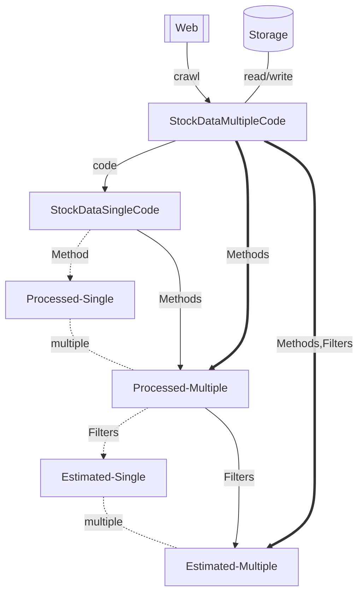

# kabutobashi

[](https://github.com/gsy0911/kabutobashi/actions?query=workflow%3Apytest)
[](https://codecov.io/gh/gsy0911/kabutobashi)
[](https://github.com/psf/black)
[](https://pycqa.github.io/isort/)

[](https://pypi.org/project/kabutobashi/)
[](https://pypi.org/project/kabutobashi/)
[](https://kabutobashi.readthedocs.io/en/latest/?badge=latest)

## concept

class-relationship.



- StockDataMultipleCode 
  - contains multiple code & multiple date
- StockDataSingleCode
  - contains single code & multiple date
- Processed (Single)
  - is from `StockDataSingleCode` using single `Method`
- Processed (Multiple)
  - is from `StockDataSingleCode` using multiple `Method`
- Estimated (Single)
  - is from `Processed (Multiple)` using single `EstimateFilter`
- Estimated (Multiple)
  - is from `Processed (Multiple)` using multiple `EstimateFilter`

## usage

```python
import kabutobashi as kb

file_path_list = [...]
sdmc = kb.reader.csv(file_path_list)
for sdsc in sdmc.to_code_iterable():
    processed = sdsc.to_processed(methods=kb.methods)
    print(processed.get_impact())


# n日前までの営業日の日付リストを取得する関数
target_date = "2020-01-01"
date_list = kb.get_past_n_days(target_date, n=40)

```
